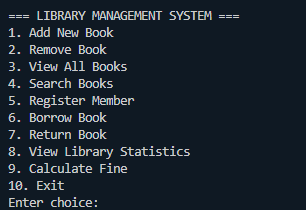
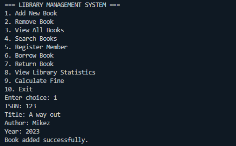
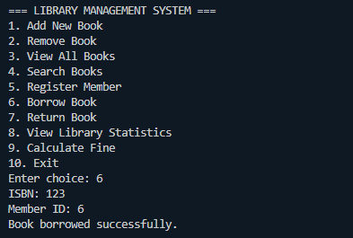

# Console-Based Library Management System

## Project Description
A Java console application for managing library operations including book tracking, member management, and borrowing system with file-based data persistence.

## Features
- Add, remove, and search for books
- Register and manage library members
- Borrow and return books with due dates
- Calculate overdue fines
- File-based data persistence
- Comprehensive input validation
- Library statistics generation

## Setup and Installation
1. Ensure you have Java installed on your system (Java 8 or higher).
2. Clone the repository or download the project files.
3. Create the following directory structure if it does not already exist:
   ```
   data/
   ```
4. Ensure the following files exist in the `data/` directory:
   - `books.txt`
   - `members.txt`
5. Compile and run the application using the instructions below.

## How to Run
```bash
# Compile and run
javac -d bin src/main/java/library/*.java
java -cp bin library.Main
```

## Sample Menu
```text
=== LIBRARY MANAGEMENT SYSTEM ===
1. Add New Book
2. Remove Book
3. View All Books
4. Search Books
5. Register Member
6. Borrow Book
7. Return Book
8. View Library Statistics
9. Calculate Fine
10. Exit
Enter your choice:
```

## Code Structure

### Classes
- `Main`: Entry point for the application.
- `Library`: Core functionality for managing books and members.
- `Book`: Represents a book with attributes like ISBN, title, author, year, availability, and due date.
- `Member`: Represents a library member with attributes like ID, name, and borrowed books.
- `FileHandler`: Handles file-based persistence for books and members.

### Data Files
- `data/books.txt`: Stores book information.
- `data/members.txt`: Stores member information.

## Example Data
### books.txt
```
123|Bla bla|MIKEZ|2025|true|null|null
```

## Functionality Overview

### Book Management
- Add new books
- Remove books (only if not borrowed)
- View all books
- Search books by title or author

### Member Management
- Register new members
- View member details

### Borrowing System
- Borrow books (updates availability and due date)
- Return books (updates availability and clears due date)

### Statistics
- View library statistics (total books, available books, borrowed books, overdue books, registered members)

### Fine Calculation
- Calculate overdue fines based on days overdue.

## Technical Requirements
- **Encapsulation**: All classes use private fields with getter and setter methods.
- **File I/O**: The `FileHandler` class manages reading and writing to `books.txt` and `members.txt`.
- **ArrayLists**: Used for storing collections of books and members.
- **Input Validation**: Comprehensive validation ensures data integrity.

## GitHub Structure
```
week3-library-system/
│── src/
│   ├── main/
│       ├── java/
│           ├── library/
│               ├── Book.java
│               ├── FileHandler.java
│               ├── Library.java
│               ├── Main.java
│               ├── Member.java
│── data/
│   ├── books.txt
│   ├── members.txt
```

## Screenshots
### Main Menu


### Adding a Book


### Borrowing a Book


## Notes
- Ensure `data/books.txt` and `data/members.txt` exist in the `data/` directory.
- Overdue fine is calculated at ₹5 per day.